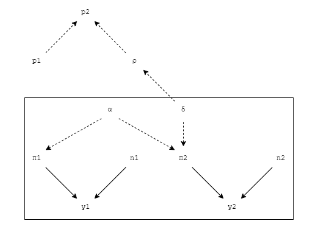

```{r setup, include=FALSE}
knitr::opts_chunk$set(echo = FALSE, fig.align = "center")
source("stat0019_ica.R")
```

\newpage

\* All referenced plots are stored in Appendix A at the end of the report.

# Question 1

We have two treatment arms where $t=1=\text{status quo}=\text{no prophylaxis}$ and $t=2=\text{active intervention}=\text{antibiotics prophylaxis}$.

For people with condition $s$, where $s=1$ represents experienced severe complication and $s=0$ not experienced, the lengths of stay in hospital is denoted $l_s$.

For treatment arm $t$, the yearly average cost and average QALYs are denoted $\mu_{ct}$ and $\mu_{et}$, respectively; the probability of severe complications is denoted $p_t$; and the monetary net benefit function is denoted $\text{NB}_t(\boldsymbol{\theta})$, where $\boldsymbol{\theta}=(p_t,l_s)$ and $k$ is the willingness to pay (in £s per unit QALY gained).

### 1.1 Average Cost & Average QALYs

As instructed, we model $\mu_{ct}$ and $\mu_{et}$, for $t=1$, as follows:

$$
\begin{aligned}
\mu_{e1} &= p_1\times(l_1\times0.0013151 + (365 - l_1)) + (1 - p_1)\times(l_0\times0.0025205 + (365 - l_0)) \\
         &= p_1\times(l_1\times-0.9986849+l_0\times0.9974795) - l_0\times0.9974795+365 \\
\mu_{c1} &= p_1\times(l_1\times168.19) + (1 - p_1)\times(l_0\times113.61) \\
         &= p_1\times(l_1\times168.19-l_0\times113.61)+l_0\times113.61
\end{aligned}
$$

And for $t=2$, as follows:

$$
\begin{aligned}
\mu_{e2} &= p_2\times(l_1\times0.0013151 + (365-l_1)) + (1-p_2)\times(l_0\times0.0025205 + (365 - l_0)) \\
         &= p_2\times(l_1\times-0.9986849 + l_0\times0.9974795)-l_0\times0.9974795+365 \\
\mu_{c2} &= p_2\times(l_1\times168.19)+(1-p_2)\times(l_0\times113.61)  + 201.47 \\
         &= p_2\times(l_1\times168.19-l_0\times113.61)+l_0\times113.61 + 201.47
\end{aligned}
$$

Where the numerical constants are given data: $0.0013151$ and $0.0025205$ are utility score associated with a single day of hospitalisation with or without severe complications; $168.19$ and $113.61$ are cost (in £) of daily impatient stay for individuals who experience and who do not experience severe complications; and $201.47$ the total cost (in £) of the prophylaxis.

### 1.2 Monetary Net Benefit Function

We model $\text{NB}_t(\boldsymbol{\theta})$ as follows:

$$
\text{NB}_t(\boldsymbol{\theta}) = k\mu_{et} - \mu_{ct}
$$

Using results from Section 1.1, under $t=1$, the above formula can be expanded to:

$$
\begin{aligned}
\text{NB}_1(\boldsymbol{\theta}) &= k\times\left\{p_1\times(l_1\times0.0013151 + (365 - l_1)) + (1 - p_1)\times(l_0\times0.0025205 + (365 - l_0))\right\} \\
&- \left\{p_1\times(l_1\times168.19) + (1 - p_1)\times(l_0\times113.61)\right\}
\end{aligned}
$$

And under $t=2$, it can be expanded to:

$$
\begin{aligned}
\text{NB}_2(\boldsymbol{\theta}) &= k\times\left\{p_2\times(l_1\times0.0013151 + (365-l_1)) + (1-p_2)\times(l_0\times0.0025205 + (365 - l_0))\right\} \\
&- \left\{p_2\times(l_1\times168.19)+(1-p_2)\times(l_0\times113.61)  + 201.47\right\}
\end{aligned}
$$

\newpage

# Question 2

### 2.1 Model Description

The model contains two parts. First, we build a module to estimate the probability of getting severe complication in the general population $p_1$. We are given that this probability is estimated to be between $4\%$ and $12\%$. We encoded this information to an informative $\text{Beta}(26,300)$ prior. The distribution is defined on the probability support $(0,1)$ and the specified parameters allows $>99\%$ chance to fall within range $(4\%,12\%)$ (plot see Appendix A).

The second module used the data from the placebo-controlled randomised study. For treatment arm $t=1,2$, we have available data on $y_t$, the number of people who experienced severe complication, and $n_t$, the number of patients in the arm. We model this data using a Binomial specification:

$$
y_t \sim \text{Binomial}(\pi_t,n_t)
$$

The parameter $\pi_t$ indicate the study and treatment specific chance of experiencing severe complications. Using logit specification, we model this as:

$$
\text{logit}(\pi_1)=\alpha\qquad\text{logit}(\pi_2)=\alpha+\delta
$$

Where $\alpha$ is the baseline probability of severe complications on logit scale and $\delta$ is the probability increment under prophylaxis treatment on logit scale. Both of them are modelled using less informative prior distributions:

$$
\alpha\sim\text{Normal}(0,10000)\qquad\delta\sim\text{Normal}(0, 10000)
$$

Performing the addition of the probability measures on the logit scale ensures that the resulted sum after the inverse logit transformation ($\pi_2$), will always lie within the probability support $(0,1)$.

We combine the two modules to derive an estimation for $p_2$, the probability of experiencing severe complication in the population treated with antibiotics prophylaxis. The odds ratio $\rho$ for $t=2$ against $t=1$ is:

$$
\rho:=\frac{p_2}{1-p_2}/\frac{p_1}{1-p_1}=\exp(\delta)
$$

Transforming this gives us the expression for the required probability $p_2$ as:

$$
p_2=\frac{\rho p_1/(1-p_1)}{1+\rho p_1(1-p_1)}
$$

The above framework is visualised using the graph below, with solid arrows denoting probabilistic relationships and dashed arrows denoting logical relationships:



### 2.2 Length of Staying in Hospital

The average $\mu_{ls}$ and standard deviation $\sigma_{ls}$ of the length of stay in hospital to recover from the surgery for people with condition $s$ are given above. Since the length of stay should be non-negative, we decided to describe it using Gamma distribution, which is defined on $(0,\infty)$. We model length of stay as:

$$
l_t \sim \text{Gamma}(\alpha_s, \beta_s)
$$

Where $\alpha_s = \frac{\mu_s^2}{\sigma_s^2}$ and $\beta_t = \frac{\mu_s}{\sigma_s^2}$. This transformation allows the mean and variance of the Gamma distribution to match the given $\mu_s$ and $\sigma_s^2$, respectively. The parameters are defined using the data presented above. The realised forms for each arm are:

$$
l_0 \sim \text{Gamma}(5.867, 1.346) \qquad l_1 \sim \text{Gamma}(256.915, 7.633)
$$

### 2.3 Population Average Cost & Benefits

The model for $\mu_{et}$ and $\mu_{ct}$ are direct implementation of formulas derived in Section 1.1. The results will be presented in the following sections.

### 2.4 Model Convergence

For our model, when performing Gibbs Sampling via BUGS, we use $10,000$ iterations with $2$ chains, each with $100$ burn-in, which gave us $19,800$ output samples for the analysis. The model result is displayed below:

```{r 2.4}
print(model.bugs, digits = 3)
```

We see for all parameters of interest, $\hat{R}$ is below $1.1$ and is very close to $1$; the effective sample size, `n.eff`, are all well above $4000$; and the resulted DIC measure also remains within an acceptable range. These criterion indicates our model's convergence.

Traceplots of parameters (see Appendix A) indicate the two simulated chains are mostly overlapping and alternating in a consistent range of values, which is evidence of convergence.

\newpage

# Question 3

Given the [recommendation from NICE](https://www.nice.org.uk/process/pmg6/chapter/assessing-cost-effectiveness), the maximum willingness to pay threshold in UK is £$30,000$ per QALY gained. In the primary analysis of the cost-effectiveness about the intervention, we will set an arbitary maximum willingness to pay of $k=1000$. The summary output using R package `BCEA` is presented below:

```{r 3.1}
summary(he)
```

According to the summary, the expected net benefit is greater for prophylaxis treatment group than status quo group. EIB is positive under the willingness to pay threshold ($k=1000$), hence the prophylaxis intervention ($t=2$) is more cost-effective than the status quo ($t=1$). Further, the value of ICER is `r round(as.numeric(he$icer),3)` with an optimal CEAC of `r max(he$ceac)`.

From the CE plane plot, ICER is located at the South-East quadrant on Cost-Effectiveness plane. The location of ICER suggests that, comparing to status quo, the new treatment leads to a larger effectiveness at a lower cost, suggesting the intervention is generally cost-effective and the prophylaxis treatment is preferred for any willingness to pay $k\geq0$.

Additionally, the CE plane and contour plot show that incremental effectiveness and incremental cost are negatively correlated: greater incremental effectiveness tends to imply less incremental cost.

The EIB plot is conducted in order to check the range of willingness to pay. The result shows the EIB is positive even at zero willingness to pay. This provides additional support for the previous conclusion.

The value of CEAC indicates the probability that an intervention is cost-effective compared with the status quo, given the observed data and specified $k$. The CEAC plot shows the probability of cost-effectiveness is around $0.6$ without additional willingness to pay ($k = 0$). Further, the probability can be boosted to over $90\%$ by a small increase in the willingness to pay of less than £$200$. This marks that prophylaxis treatment is overall effective and highly affordable.

Overall, as a decision maker of the healthcare system, we found the prophylaxis treatment beneficial and cost-effective, so we decide to implement it.

\newpage

# Appendix A

```{r figures1}
x <- seq(0,0.2,0.001)
plot(x, dbeta(x, shape1.p1, shape2.p1), type = "l",
	 main = "Figure 1: Beta(26,300) Prior for p1", xlab = "p1", ylab = "probability density")
abline(v = c(0.04, 0.12), col = "blue")
```

\newpage

```{r figures_traceplots, fig.height = 12, fig.width=10}
par(mfrow = c(4, 2))
for (i in params) {
	plot(model.bugs$sims.array[ , 1, i], type = "l", col = "red",
		 main = paste("Traceplot for", i), ylab = "value")
	lines(model.bugs$sims.array[ , 2, i], col = "blue")
}
```

\newpage

```{r figures2, fig.height=8, fig.width=10}
par(mfrow = c(2,2))
ceplane.plot(he, wtp = 1000, main = "Figure 2: Cost-Effectiveness Plane")
contour(he, main = "Figure 3: Contour Plot")
eib.plot(he, main = "Figure 4: Expected Incremental Benefit")
ceac.plot(he, main = "Figure 5: Cost-Effectiveness Acceptability Curve")
abline(h = 0.9, col = "red")
legend("bottomright", legend = "0.9", lty = 1, col = "red")
```

\newpage

# Declaration of Ownership

We are aware of the UCL Statistical Science Department's regulations on plagiarism for assessed coursework and are aware of UCL's policy on plagiarism and collusion. We also confirm that the work hereby submitted has been conducted in a collaborative way among all the members of the team.

By submitting the R and/or BUGS scripts as detailed in the text of the ICA, we hereby affirm that the work has entirely been carried out by us.
