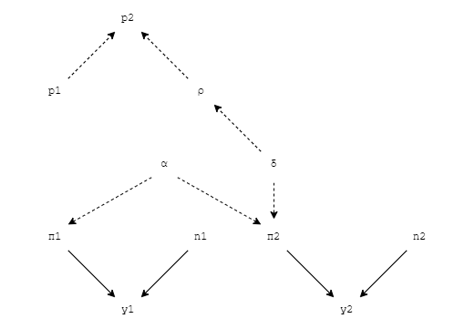

```{r setup, include=FALSE}
knitr::opts_chunk$set(echo = FALSE, fig.align = "center")
source("stat0019_ica.R")
```

## Question 1

We have two treatment arms where $t=1=\text{status quo}=\text{no prophylaxis}$ and $t=2=\text{active intervention}=\text{antibiotics prophylaxis}$.

For people with condition $s$, where $s=1$ represents experienced severe complication and $s=0$ not experienced, the lengths of stay in hospital is denoted $l_s$.

For treatment arm $t$, the average cost and average QALYs are denoted $\mu_{ct}$ and $\mu_{et}$, respectively; the probability of severe complications is denoted $p_t$; and the monetary net benefit function is denoted $\text{NB}_t(\boldsymbol{\theta})$, where $\boldsymbol{\theta}=(e,c;p_t,l_s,k)$ and $k$ is the willingness to pay (i.e. the maximum amount people are willing to contribute in order to gain one extra unit of QALY).

#### 1.1 Average Cost & Average QALYs

As instructed, we model $\mu_{ct}$ and $\mu_{et}$, for $t=1$, as follows:

$$
\begin{aligned}
\mu_{e1} &= p_1\times(l_1\times0.0013151 + (365 - l_1)) + (1 - p_1)\times(l_0\times0.0025205 + (365 - l_0)) \\
\mu_{c1} &= p_1\times(l_1\times168.19) + (1 - p_1)\times(l_0\times113.61)
\end{aligned}
$$

And for $t=2$, as follows:

$$
\begin{aligned}
\mu_{e2} &= p_2\times(l_1\times0.0013151 + (365-l_1)) + (1-p_2)\times(l_0\times0.0025205 + (365 - l_0)) \\
\mu_{c2} &= p_2\times(l_1\times168.19)+(1-p_2)\times(l_0\times113.61)  + 201.47
\end{aligned}
$$

Where the numerical constants are given data: $0.0013151$ and $0.0025205$ are utility score associated with a single day of hospitalisation with or without severe complications; $168.19$ and $113.61$ are cost (in £) of daily impatient stay for individuals who experience and who do not experience severe complications; and $201.47$ the total cost (in £) of the prophylaxis.

#### 1.2 Monetary Net Benefit Function

We model $\text{NB}_t(\boldsymbol{\theta})$ as follows:

$$
\text{NB}_t(\boldsymbol{\theta}) = k\mu_{et} - \mu_{ct}
$$

Using results from Section 1.1, under $t=1$, the above formula can be expanded to:

$$
\begin{aligned}
\text{NB}_1(\boldsymbol{\theta}) &= k\times\left\{p_1\times(l_1\times0.0013151 + (365 - l_1)) + (1 - p_1)\times(l_0\times0.0025205 + (365 - l_0))\right\} \\
&- \left\{p_1\times(l_1\times168.19) + (1 - p_1)\times(l_0\times113.61)\right\}
\end{aligned}
$$

And under $t=2$, it can be expanded to:

$$
\begin{aligned}
\text{NB}_2(\boldsymbol{\theta}) &= k\times\left\{p_2\times(l_1\times0.0013151 + (365-l_1)) + (1-p_2)\times(l_0\times0.0025205 + (365 - l_0))\right\} \\
&- \left\{p_2\times(l_1\times168.19)+(1-p_2)\times(l_0\times113.61)  + 201.47\right\}
\end{aligned}
$$

\newpage

## Question 2

#### 2.1 Model Description

The model contains two parts. First, we build a module to estimate the incidence of getting severe complication in the general population $p_1$. Given that this probability is estimated to be $4\%$ to $12\%$, we encoded this information to an informative $\text{Beta}(26,300)$ prior. The distribution is defined on the probability support $(0,1)$ and the specified parameters allows $>99\%$ chance to fall within range $(4\%,12\%)$, shown by the plot below:

```{r 2.1, fig.width = 4, fig.height = 3}
x <- seq(0,0.2,0.001)
plot(x, dbeta(x, shape1.p1, shape2.p1), type = "l",
	 main = "Beta(26,300) Prior", xlab = "", ylab = "probability density")
abline(v = c(0.04, 0.12), col = "blue")
```

The second module used the data from the placebo-controlled randomised study. For treatment arm $t=1,2$, we have available data on $y_t$, the number of people who experienced severe complication, and $n_t$, the number of patients in the arm. We model this data using a Binomial specification:

$$
y_t \sim \text{Binomial}(\pi_t,n_t)
$$

The parameter $\pi_t$ indicate the study and treatment specific chance of experiencing severe complications. Using logit specification, we model this as:

$$
\text{logit}(\pi_1)=\alpha\qquad\text{logit}(\pi_2)=\alpha+\delta
$$

Where $\alpha$ and $\beta$ have less informative prior distributions:

$$
\alpha\sim\text{Normal}(0,10000)\qquad\delta\sim\text{Normal}(0, 10000)
$$

We combine the two modules to derive an estimation for $p_2$, the probability of experiencing severe complication in the population treated with antibiotics prophylaxis. The odds ratio $\rho$ for $t=2$ against $t=1$ is:

$$
\rho:=\frac{p_2}{1-p_2}/\frac{p_1}{1-p_1}=\exp(\delta)
$$

Transforming this gives us the expression for the required probability $p_2$ as:

$$
p_2=\frac{\rho p_1/(1-p_1)}{1+\rho p_1(1-p_1)}
$$

The above framework is visualised using the graph below:



#### 2.2 Length of Staying in Hospital

The average $\mu_{ls}$ and standard deviation $\sigma_{ls}$ of the length of stay in hospital to recover from the surgery for people with condition $s$ are given above. We model length of stay as:

$$
l_t \sim \text{Gamma}(\alpha_s, \beta_s)
$$

Where $\alpha_s = \frac{\mu_s^2}{\sigma_s^2}$ and $\beta_t = \frac{\mu_s}{\sigma_s^2}$. This transformation allows the mean and variance of the Gamma distribution to be $\mu_s$ and $\sigma_s^2$, respectively. The parameters are defined using the data presented above. The realised formation is:

$$
l_0 \sim \text{Gamma}(5.867, 1.346) \qquad l_1 \sim \text{Gamma}(256.915, 7.633)
$$

#### 2.3 Population Average Cost & Benefits

The model for $\mu_{et}$ and $\mu_{ct}$ are direct implementation of formulas derived in Section 1.1. The results will be presented in the following sections.

#### 2.4 Model Convergence

```{r 2.4}

```

## Question 3

#### 3.1 Cost-Utility Analysis

```{r 3.1}
summary(he)
```

According to the summary,the expected net benefit of treatment is greater than of status quo, EIB is positive (139.9) under the willingness to pay threshold (k = 100), hence the intervention (t=2) is more cost-effective than the control group (t=1).

The value of CEAC suggests that that the intervention is cost-effective compared with the alternative, given the data and for a given value of the maximum acceptable ratio is 0.890583.

The value of ICER is negative (ICER =-13.315 ) and it is located at the South-East quadrant on CE plane.

The location of ICER suggests that a larger effectiveness can be caused by a lower cost, so we can deduce that the intervention is generally cost-effective and the status quo is preferred for the willingness to pay threshold (k=100).

An EIB plot is conducted in order to comfirm the range of willingness to pay. According to the EIB plot, the EIB is always positive if k\>0 which suggests that the intervention (prophylaxis antibiotic) is cost-effective no matter there is willing to pay or not.

Besides, from the contour plot, a negative linear correlation is detected between incremental effectiveness and incremental cost: the greater incremental effectiveness, the less incremental cost.

Overall, As a decision maker of the healthcare system, we would like to decide implement this treatment in the future.

\newpage

## Declaration of Ownership

We are aware of the UCL Statistical Science Department's regulations on plagiarism for assessed coursework and are aware of UCL's policy on plagiarism and collusion. We also confirm that the work hereby submitted has been conducted in a collaborative way among all the members of the team.

By submitting the R and/or BUGS scripts as detailed in the text of the ICA, we hereby affirm that the work has entirely been carried out by us.
